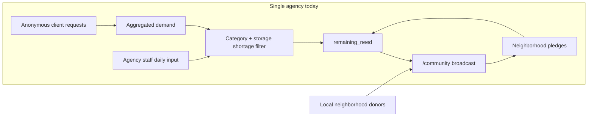

# Zero-integration shortage broadcast (pitch-aligned plan)

## Pitch

> "I have built a zero-integration, anonymous tool that allows your partner agencies to broadcast their daily shortages directly to local neighborhood donors, reducing your logistical delivery burden for high-demand items."

## How the built product maps to the pitch

| Pitch claim | Product behavior |
|---|---|
| **Zero-integration** | No Link2Feed, no inventory APIs, no per-item stock sync. Agency uses a browser + SQLite/Turso only. |
| **Anonymous** | Client orders store no household name; `/status` removed. Donors can pledge anonymously. |
| **Partner agency broadcasts daily shortages** | Agency admin sets daily category/storage levels at [`/admin/capacity`](food_bank/templates/admin_capacity.html), previews at [`/admin/community`](food_bank/templates/admin_community.html), publishes to [`/community`](food_bank/templates/community.html). |
| **Local neighborhood donors** | Public needs board + pledge form at `/community/pledge`; shareable URL/QR, no login. |
| **Reduce delivery burden for high-demand items** | `get_donor_needs()` in [`store.py`](food_bank/store.py) surfaces only shortage-eligible items, sorted by category priority (`critically_low` first); `high`/`full` categories and full storage types are hidden. |

## Agency model

**Now:** Single partner agency per deployment — one admin password, one trip context, one public board URL. This matches current [`app.py`](food_bank/app.py) and `kv_store` design.

**Later (document only, not built):** Multi-agency expansion would add an `agency_id` (or subdomain/slug) to trip settings, `staff_thresholds`, pledges, and archive — without changing the zero-integration shortage-broadcast model.

**Formula:** `remaining_need = client_demand - active_pledges`, shown only when agency marks category/storage as accepting donations.

| Agency shortage signal | Donor board effect |
|---|---|
| Category **Critically Low** / **Low** | Show item; sort to top |
| Category **OK** | Show if demand exists |
| Category **High** / **Full** | Hide (agency has enough) |
| Storage **Full** (Dry / Refrigerated / Frozen) | Block all items in that storage type |

---

## Completed foundation (original pivot)

All six architecture todos are **completed**:

- `storage_type` on catalog + `staff_thresholds` kv helpers
- `get_donor_needs()` / rewritten `get_community_needs()` (no fulfillment gate)
- `/admin/capacity` page + admin nav
- Privacy cleanup (no names, no `/status`)
- Pledge `received` is status-only (no inventory side effects)
- Inventory/plan routes redirect; archive snapshots capacity; README updated

---

## Completed: pitch-aligned copy (PR #2)

All five copy-phase todos are **completed** (commit `6eb6ebd`):

### 1. Agency admin copy

- **Staff capacity** → **Daily shortage broadcast** ([`admin_capacity.html`](food_bank/templates/admin_capacity.html))
- **Community** → **Broadcast** with **Broadcast to neighborhood donors** ([`admin_community.html`](food_bank/templates/admin_community.html))
- Nav: **Daily shortages** / **Broadcast** ([`admin.html`](food_bank/templates/admin.html))
- Summary card: **Last broadcast set**

### 2. Donor-facing copy

- **Community Give** → **Neighborhood Give** ([`community_base.html`](food_bank/templates/community_base.html))
- Hero / empty states: **Today's shortages** ([`community.html`](food_bank/templates/community.html))
- Pledge page: neighborhood agency framing ([`community_pledge.html`](food_bank/templates/community_pledge.html))

### 3. i18n

- Pitch strings in EN, ES, ZH, VI, TL, SO ([`i18n.js`](food_bank/static/i18n.js))
- Removed `nav_status`, `status_*`, and fulfillment wording from non-English locales

### 4. Pitch-ready docs

- README opens with pitch; agency + donor workflows; **Multi-agency roadmap** ([`README.md`](food_bank/README.md))

### 5. Polish

- High-demand badge on `critically_low` items (donor board + admin preview)
- Storage-blocked badges on admin broadcast preview (e.g. "Refrigerated — not accepting donations")
- `category_level` on donor need items in [`store.py`](food_bank/store.py)

---

## Explicit non-goals (supports "zero-integration" claim)

- Link2Feed or parent-network API hooks
- Real-time warehouse/shelf inventory sync
- Auto-adjusting shortage levels when pledges arrive (agency updates manually)
- Multi-agency platform build (only document the path)
- Corporate donor portal or mobile app

---

## Next steps (optional, out of scope)

- Multi-agency: `agency_id` / URL slug per partner agency
- Archive round detail copy: legacy "Fulfillment" label in [`admin_round.html`](food_bank/templates/admin_round.html) for old snapshots only
